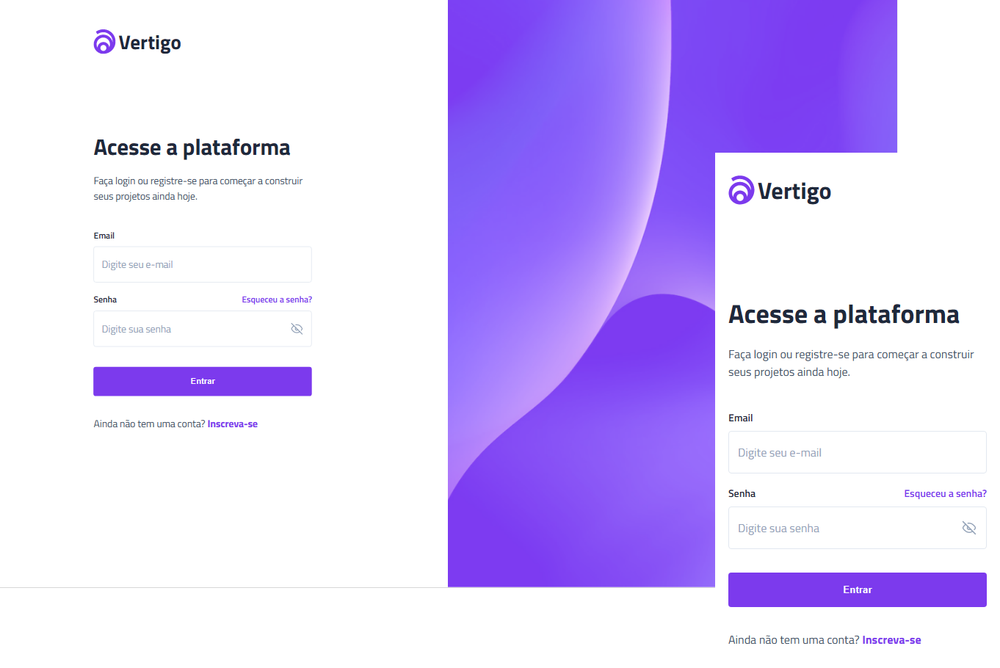

# Vertigo | #boraCodar

Projeto construído para fins didáticos, com o objetivo de colocar em prática os conhecimentos de HTML, CSS e JavaScript.

## O Projeto

---

 

 

> O projeto consiste em uma tela de login com validação de dados. Este projeto foi retirado do site [#boraCodar](https://boracodar.dev/), programa de desafios semanais realizado pela [Rocketseat](https://www.rocketseat.com.br/).

## Tecnologias

- HTML
- CSS
- Javascript

<a href="#top">⬆ Voltar ao topo</a>